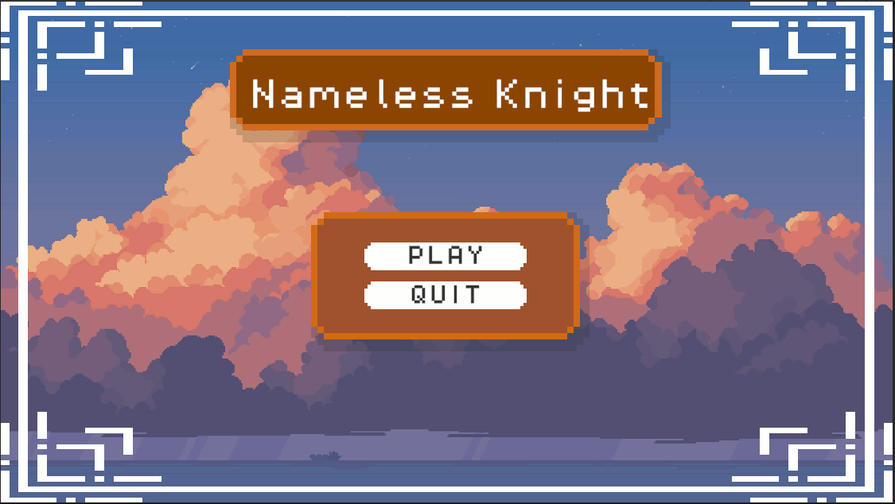
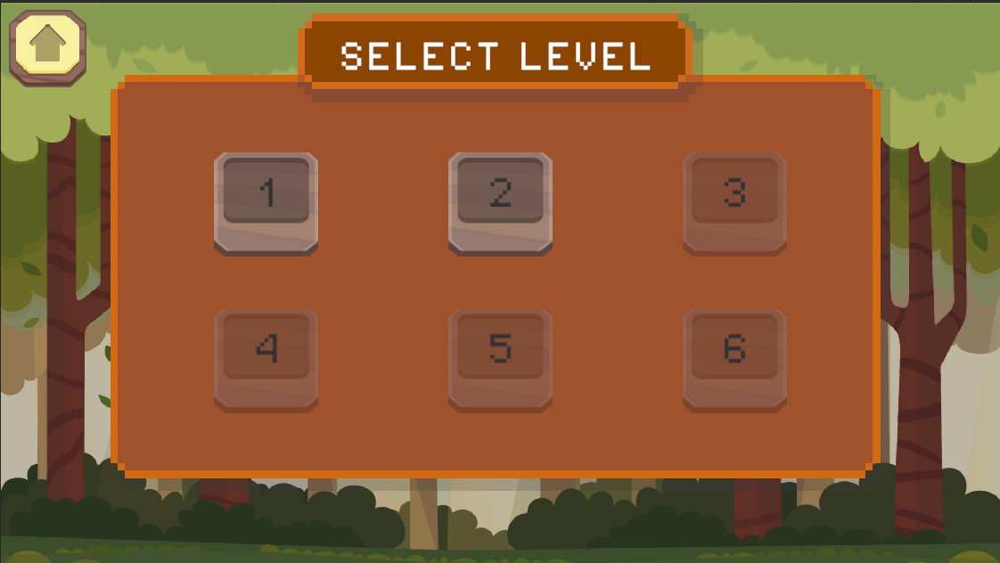
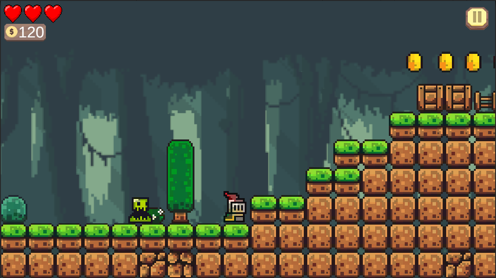
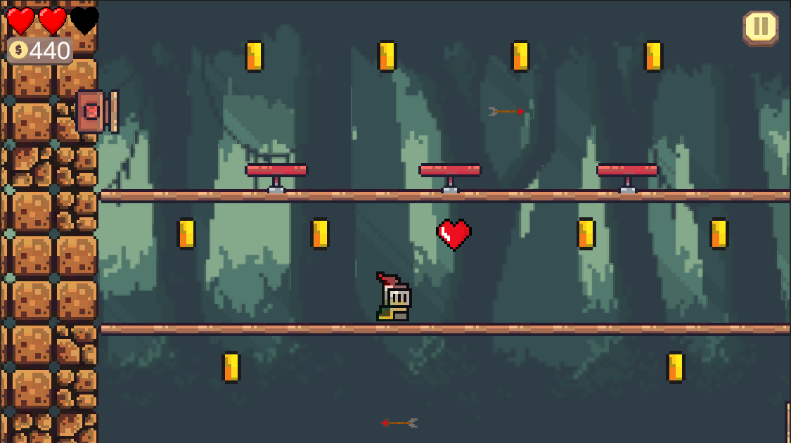
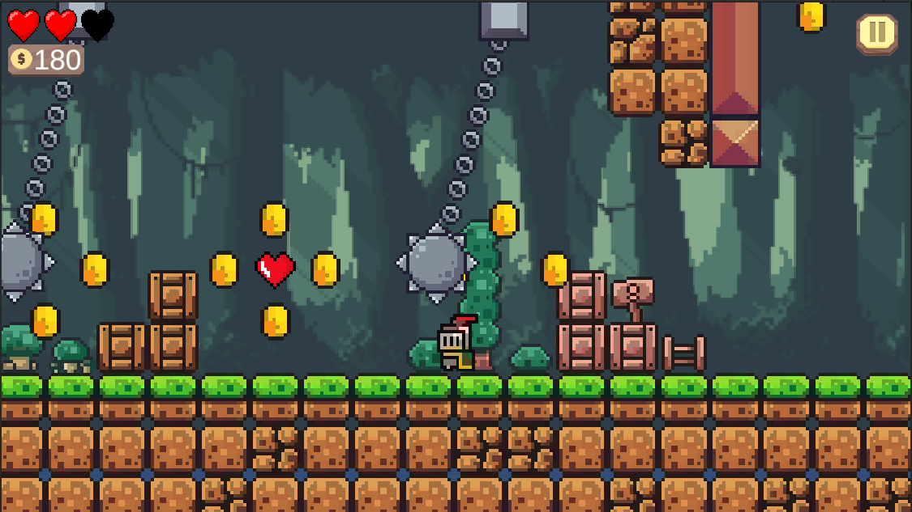
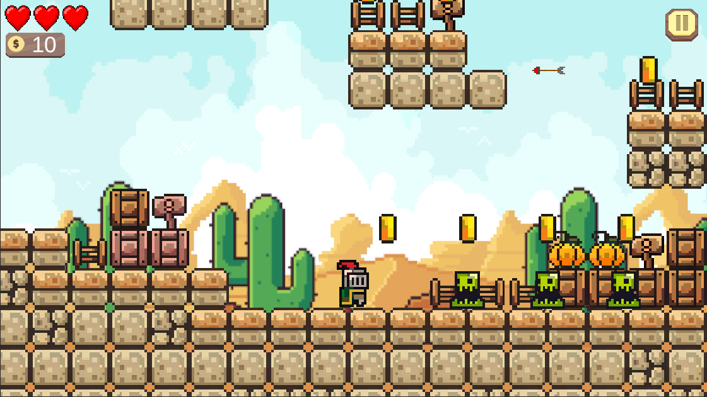
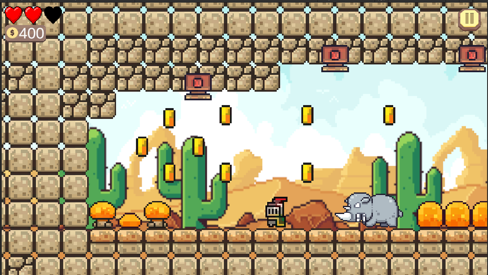
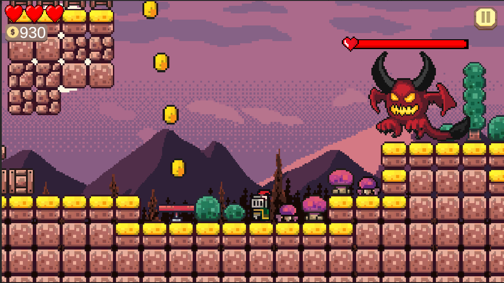
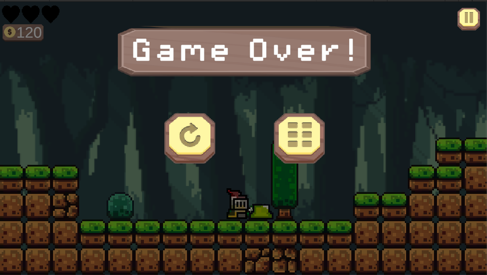
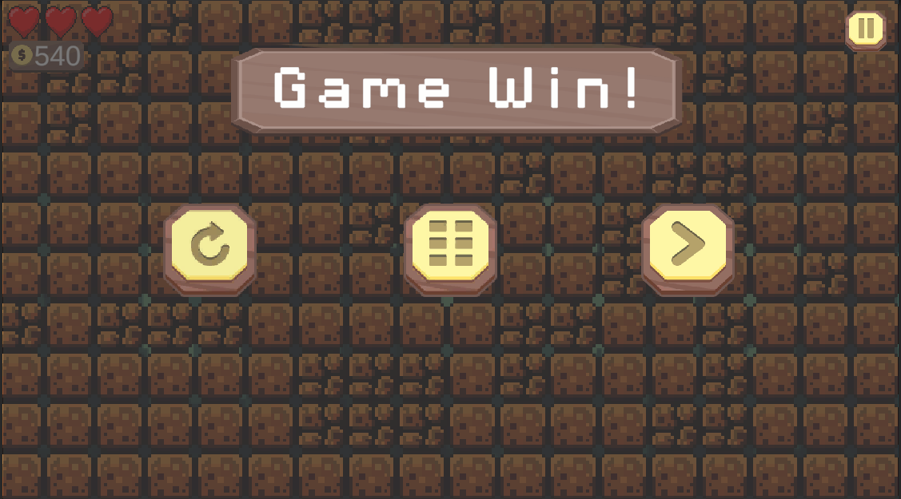

# Game_Platform_2D

## Introduction
This is a personal 2D platformer project developed with Unity. The goal of this project is to build a game focused on jumping, obstacle traversal, basic combat, and map exploration in an action-adventure direction.

This project is also a practical learning process to improve my gameplay programming skills, scene organization, enemy AI design, animation workflow, and performance optimization.

## Inspiration and Asset Copyright
- The game is inspired by classic platformer style gameplay (similar to Mario in movement rhythm and level traversal).
- This project does NOT copy and does NOT use official Mario/Nintendo assets.
- All assets in this project are self-created, edited by me, or sourced legally for personal learning and development purposes.

## Project Goals
- Build a stable and expandable 2D platformer gameplay foundation.
- Create a clear gameplay progression flow (tutorial -> map -> combat -> game over).
- Practice organizing C# source code in Unity in a maintainable way.

## Completed Work
### 1) Core Gameplay
- Implemented 2D character movement.
- Implemented jump and dash mechanics.
- Implemented basic collision logic with ground and level geometry.
- Tuned movement speed for smoother and more natural controls.

### 2) Combat and Character Systems
- Implemented a basic attack system.
- Implemented player health (HP) and mana systems.
- Implemented logic to unlock abilities based on progression.

### 3) Enemy AI
- Implemented roaming behavior.
- Implemented player detection and chasing behavior.
- Implemented attack behavior within attack range.

### 4) Scenes and Levels
- Created a Main Menu scene.
- Created a Tutorial scene for basic guidance.
- Created multiple test maps for gameplay iteration.
- Created a Game Over scene and end-of-run flow.

### 5) UI, Audio, and Experience
- Integrated basic BGM/SFX for several scenes.
- Implemented a basic menu UI and HUD.
- Optimized selected components to improve stability in the Unity Editor.

## Technologies and Tools
- Unity (LTS)
- C#
- Aseprite (sprites and animation)
- Adobe Photoshop (image editing)
- Git and GitHub (version control)

### Ingame Screenshots
- **Main Menu UI**

- **Tutorial Scene**

- **Map 1**

- **Map 2**

- **Map 3**

- **Map 4**

- **Map 5**

- **Map 6**

- **GameOver Menu**

- **GameOver Menu**

## Next Update Plan
- Improve combat feel (timing, and hit feedback).
- Add new enemy types and expand AI behaviors.
- Redesign selected maps to increase exploration quality.
- Complete boss fights with unique mechanics.
- Improve UI/UX and settings systems.
- Further optimize performance for low-end machines..